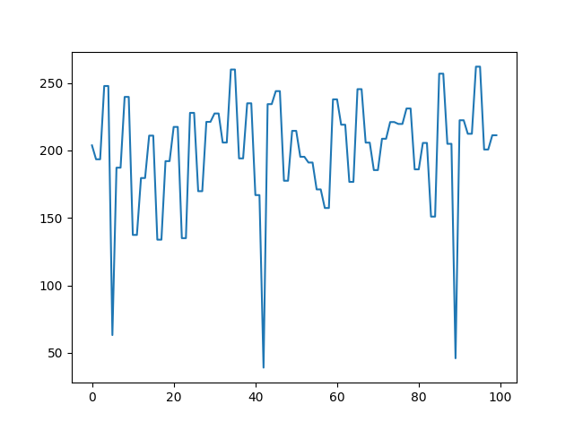
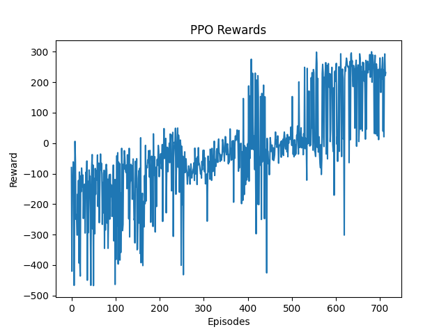

# **Deep Reinforcement Learning**  

## **Introduction**  
<p style="font-size: 18px;">In this Lab I implented the **REINFORCE** and **DQN** algorithm to solve the **CartPole-v1** and the **Lunar-Lander-v3** environments using deep reinforcement learning. 

## **Dependencies**  
Make sure you have the following libraries installed before running the code:  

```bash
pip install torch gymnasium[box2d] matplotlib numpy gymnasium[other]
```

- **gymnasium**: For the CartPole and Lunar_Lander simulation environment  
- **torch**: To define and train neural networks  
- **matplotlib**: To visualize results  
- **numpy**: For numerical computations  

## **Running the Training**  
To train the model, run:  

```bash
python name_script.py train
```

Once trained, you can test the model using:  

```bash
python name_script.py test
```

where **name_script** can be 'cartpole' or 'LunarReinforce' 
<br><br>

## **REINFORCE**

### **CARTPOLE**  
<p style="font-size: 18px;">The goal is to balance a pole on a moving cart for as long as possible by learning an optimal policy through policy gradients.The algorithm is considered solved when it achieves an average greater than 195 over 100 consecutive episodes.
This environment can be easily solved using the REINFORCE algorithm with well-chosen hyperparameters for the policy network and optimizer. In this case, I achieved rewards close to 8000 in under 200 episodes.
<br><br>


<br><br>


### **LUNAR LANDER**
<p style="font-size: 18px;">To solve the LunarLander environment, the agent needs to achieve a score of 200 or higher for approximately 100 consecutive episodes.The REINFORCE algorithm leads to highly unstable results with significant variance in the obtained scores. To mitigate this issue, I added an extra layer to the policy network, reduced the gamma parameter to 0.95, introduced entropy regularization, and applied gradient clipping. However, these adjustments did not yield significant improvements—catastrophic forgetting remains a problem, and the average score still hovers around 20 points.
<br><br>


<br><br>


<br><br>

## **DQN**
<p style="font-size: 18px;">To successfully solve the Lunar Lander environment, I implemented a Deep Q-Network (DQN) with a replay buffer and update the network every four iterations to reduce variance. Epsilon decay was used to allow the agent to explore different alternatives, especially in the early stages of training. Also the use of Huber loss proved beneficial in improving stability. Additionally, I applied gradient clipping to further stabilize the training process.

<p style="font-size: 18px;">The resulting model performs very well on this task, consistently solving the environment in approximately 160–180 episodes. Below, I have included the scores obtained over the 100 'winning episodes.'
<br><br>



<br><br>
<p style="font-size: 18px;">And here is the final landing...
<br><br>


## **PPO**
<p style="font-size: 18px;">As an exercise, I implemented a version of the Proximal Policy Optimization (PPO) algorithm and applied it to the Lunar Lander environment. My goal was to understand how PPO is implemented and explore some fundamental mechanisms, even in the context of a relatively simple problem.
In my implementation the train method receives a given maximum number of training steps and stops either if the treshold of 100 episodes with threshold greater than 200 is encountered either if max steps is reached.
As usual with policy method the policy network is updated every 'n' steps where 'n' is given by the update_timesteps parameters, for each of this steps the tuple of  state, action taken, reward and next state is saved on a replay buffer with logprobabilities and advantage estimation.
During the update phase, the memory buffer is shuffled and used as a dataset to update our policy parameters with Adam Optimizer, the actor loss is calculated as usual with the minimum between a surrogate objective function and its clipped version and summing the critic loss as the mean squared error between predicted state values and returns, but in this case I added an entropy term to augment the exploration.
At the end of every epoch an approximation of the kullback leibler divergence is compared with a target value not to exceed, my scope in this case was to avoid too drastical change in the policy network.
To enforce greater stability in the advantage estimation I used generalized advantage estimation GAE, during training normalization is used on each GAE advantages batch to stabilize optimization.
Below the results achieved in the Lunar Lander environment after training for approximately 700 episodes.
<br><br>



<br><br>


## **License**  
This project is released under the MIT License.
